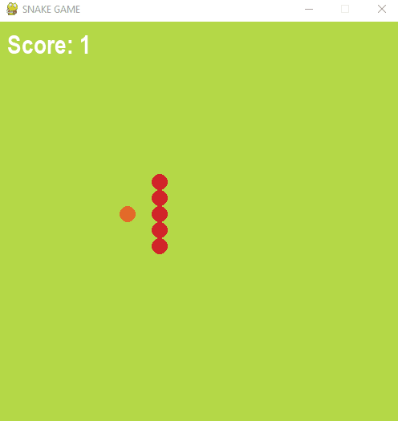

# DG_gamedev_python
This repository  contains code related to the Delhi Government Python Game Dev Training given by me as Instructor at Coding Blocks.    
## Snake Game

## Space Invader

## Collect the Coins

## Tile Smasher

## Flappy Bird

## Ping Pong

## Online Game
Demo of transmission of player's position in between clients and a server.   
